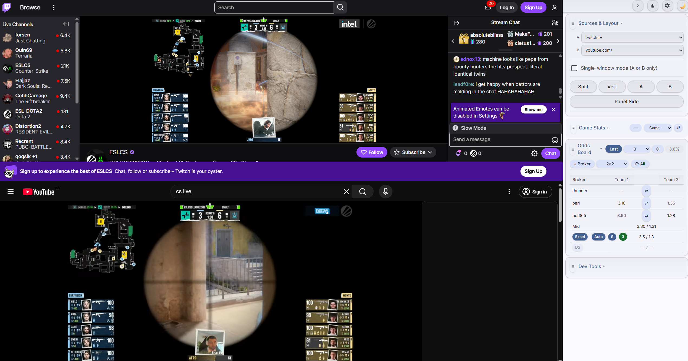
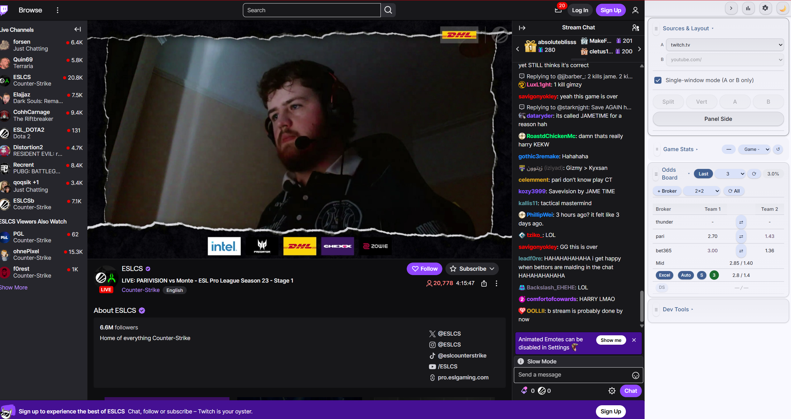
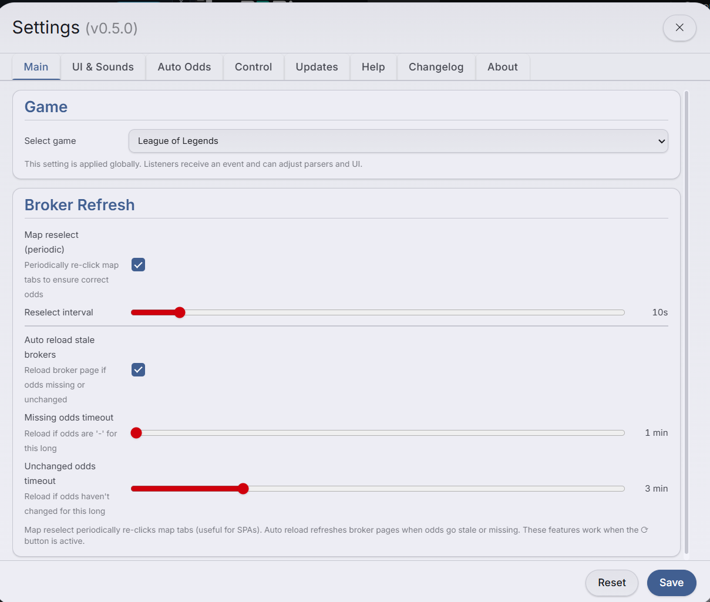
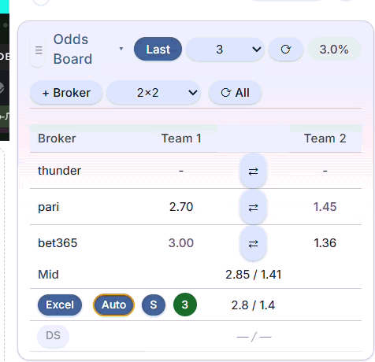

# OddsMoni Desktop

> **⚠️ Project Status: Archived**  
> This project is no longer being actively developed. I was laid off from the position this tool was built for, so there is no further need to maintain or update it. The source code remains available as-is for anyone who finds it useful or wants to build on top of it.

A desktop application for live esports trading workflows — specifically designed for **CS2** and **League of Legends** match monitoring.

Built to solve the daily pain of juggling multiple bookmaker tabs, Excel spreadsheets, and game stats during fast-paced matches. Everything you need is consolidated into one window with real-time updates.

## What It Does

**📊 Multi-Bookmaker Odds Dashboard**  
Opens multiple bookmaker sites side-by-side as embedded views. Odds are automatically extracted and displayed in a unified board — no more switching between 6+ browser tabs.

**📺 Stream + Stats in Parallel**  
Embedded panel with two slots (A/B) for streams (Twitch) and live game data (portal.grid.gg). Watch the match while monitoring odds changes.

**📈 Excel Integration**  
Connects to your working Excel file for odds adjustments. Python-based watcher reads values and displays them alongside bookmaker odds. Hotkey controller for quick navigation.

**🤖 Auto Mode**  
Assistant tool that tracks mid/average odds across bookmakers and helps you stay aligned with market movements. Configurable burst levels and adaptive behavior.

**🎮 LoL Live Stats**  
Collects key game data from portal.grid.gg (gold diff, kills, towers, dragons, barons) for faster game state assessment without switching windows.

## Screenshots & Demo

### Multi-Bookmaker View
All bookmakers open side-by-side in one window with real-time odds extraction:



### Stream Panel
Watch live matches while monitoring odds — embedded Twitch streams and game stats:



### Settings
Configure brokers, layout presets, auto mode parameters, and more:



### Auto Mode
Automatic odds tracking and alignment with market movements:



### Theme Switching
Switch between light and dark themes on the fly:


---

## Key Features

- **Broker Views**: Persistent sessions per bookmaker with independent zoom and map sync
- **Odds Board**: Docked panel showing best/mid odds, arbitrage calculations, swap per broker
- **Layout Presets**: Quick arrangements (2x2, 2x3, 1x2x2) for different screen setups
- **Map Selection**: Synced across all brokers (Map 1, 2, 3, or Match)
- **Stats Panel**: Dual-slot layout (split/vertical/focus modes) with hide/show control
- **Auto Pip Install**: Python dependencies installed automatically on first launch
- **Background Wake-Up**: Broker views stay active even when not focused

## Download

📦 **[Latest Release](https://github.com/MrLordCat/TraderData-and-odds-Monitor/releases/latest)**

Download the portable `.zip`, extract anywhere, and run `OddsMoni.exe`. No installation required.

| Asset | Description |
|-------|-------------|
| `OddsMoni-win32-x64-portable.zip` | Windows x64 portable build |

## Quick Start (Development)

Prerequisites:

- Node.js 18+
- Python 3.8+ (required for Excel Extractor scripts)
- Windows 10/11

```powershell
npm install
npm run dev
```

Build portable:

```powershell
npm run pack:zip
```

## Background & Story

This project started as a small browser extension that collected the specific League of Legends stats I needed from portal.grid. The information on the site was either incomplete or shown in a way that didn't fit my workflow, so the extension normalized and reshaped it.

Later I built another extension to scrape odds from multiple bookmakers and display them in one compact window instead of opening a dozen tabs that cover the entire screen. Over time, maintaining multiple extensions and adding the features I wanted became cumbersome. After finishing my studies at kood/, I decided I needed a full-fledged desktop application tailored to my workflow. That's how this app was born. It's still being refined and polished—and I've been building it in parallel with my day job.

## Using the App

**Top toolbar groups:**

- Brokers: add broker, apply layout presets, refresh all
- Board: toggle dock side and resize with the vertical splitter
- Stats: toggle Stats embedded view, Hide/Unhide panel button
- Dev/Settings: open DevTools for diagnostics; open UI settings

**Stats panel:**

- Two slots (A/B) for portal.grid.gg, Twitch, or embedded LoL Stats
- Layout modes: split, vertical, focus A, focus B
- Side panel on left or right with layout/source controls

**Board (odds):**

- Docked to the side of the stage; move between left/right; resize with splitter
- Receives odds from brokers and from the optional Excel watcher
- DS odds highlight: pulses red when different from Excel for >5 seconds

## Edge Extension (DS Uptime Tracker)

Optional browser extension for DS page integration:

- **Uptime tracking**: Monitors Active/Suspended states, calculates uptime percentage
- **Odds sync**: Sends DS odds to OddsMoni via WebSocket
- **Auto-update**: Check for updates directly from GitHub

Installation:

1. Open Edge → Extensions → Manage Extensions
2. Enable "Developer mode"
3. Click "Load unpacked" → select `resources/extensions/uptime/`
4. Or use Settings → Updates → Edge Extension → Open Extension Folder

## Hotkeys

| Key | Action |
|-----|--------|
| F12 | DevTools for active broker |
| Numpad5 | Toggle Auto mode |
| Alt+C | Disable Auto |

## Excel Extractor

Python script that feeds odds from your Excel workbook to the app.

> **Requires Python 3.8+** installed and available in PATH. Download from [python.org](https://www.python.org/downloads/). Make sure to check **"Add Python to PATH"** during installation.

- Auto-installs dependencies on first run (pywin32, openpyxl, watchdog, keyboard)
- Hotkey controller for quick cell navigation (Numpad 0/1, F21-F24)
- WIN/LOSE protection: hotkeys cannot override final values

## Architecture

```
main.js              → Electron main process, window/view orchestration
modules/
  ├── brokerManager  → Add/close brokers, sessions, extraction
  ├── board          → Docked odds board
  ├── stats          → Embedded stats panel (A/B slots)
  ├── layout         → View layout presets
  └── ipc/*          → Modular IPC endpoints
renderer/            → UI (toolbar, board, stats panel, settings)
brokers/extractors   → DOM parsers per bookmaker
```

## License

MIT
